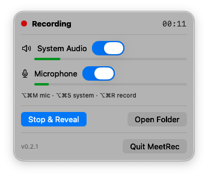

# MeetRec

[](https://www.apple.com/macos/)
[](LICENSE)
[](https://github.com/BozhengLong/meetrec/releases)

**One-click meeting recorder that lives in your Mac's menu bar.** It records both sides of any meeting, call, or livestream — their voices and yours — into a single audio file on your disk. Everything stays local: no cloud, no account, no bot joining your call.



## Install

Download `MeetRec.app.zip` from [Releases](https://github.com/BozhengLong/meetrec/releases), unzip, drag `MeetRec.app` to `/Applications`.

On first launch macOS blocks it (signed but not notarized). One-time fix, either way:

- System Settings → Privacy & Security → scroll down → **Open Anyway**, or
- `xattr -dr com.apple.quarantine /Applications/MeetRec.app`

MeetRec then walks you through the two permissions it needs. Prefer building from source? [See below](#building-from-source) — no Gatekeeper step.

## What it does

- 🎙️ Records **the whole conversation** — system audio + microphone, mixed naturally into one m4a; works with AirPods
- 🔊 **Echo cancellation, noise suppression, auto gain** on the mic — recording on speakers doesn't pick up an echo of the other side
- 🔇 Mute either side live, with global hotkeys
- 🚦 Warns loudly (alert + menu bar icon) if a recording is somehow missing system audio — never a silent failure
- 💾 Saves to `~/Recordings/YYYY-MM-DD_HHMM.m4a`, reveals in Finder on stop

| Hotkey | Action |
|---|---|
| `⌥⌘R` | Start / stop recording |
| `⌥⌘M` | Toggle microphone |
| `⌥⌘S` | Toggle system audio |

## After recording

MeetRec deliberately stops at "make a clean audio file" — no built-in transcription. Feed the m4a to [MacWhisper](https://goodsnooze.gumroad.com/l/macwhisper), [Buzz](https://github.com/chidiwilliams/buzz), ChatGPT, or:

```bash
whisper-cli -m models/ggml-large-v3.bin -f 2026-05-24_1430.m4a -l zh
```

Both channels carry the same mix; speaker separation is your transcriber's diarization job.

<details>
<summary><strong>Optional tweaks</strong></summary>

```bash
# Your own voice too quiet/loud in the mix? Mic gain in dB (default 0):
defaults write com.local.meetrec MicGainDb -float 6

# Prefer the raw, unprocessed mic sound? Turn off echo cancellation & co:
defaults write com.local.meetrec DisableAEC -bool true
```

</details>

## Permissions

| Permission | Why |
|---|---|
| Microphone | Records your voice |
| Screen Recording | macOS gates system-audio capture behind it. **No video is ever saved** |

MeetRec detects what's missing at launch and guides you. If things ever get stuck, the last resort is `tccutil reset ScreenCapture com.local.meetrec`, then relaunch and re-grant.

## Known limitations

- **No pause** — stop & restart creates a new file
- **Prebuilt app is Apple Silicon only** — Intel Macs: build from source
- **Not notarized** — first launch needs the one-time Gatekeeper step (see Install)
- **Switching the output device mid-recording** is untested; switching the input device mid-recording keeps capturing from the original mic (by design)

## Building from source

Requires macOS 14.2+ and an Xcode 15+ / Swift 5.9+ toolchain.

```bash
git clone https://github.com/BozhengLong/meetrec.git
cd meetrec
./make-app.sh         # → ./MeetRec.app
```

Locally built apps aren't quarantined, so there's no Gatekeeper prompt. With an Apple Development certificate present, `make-app.sh` signs with it automatically and your permission grants survive rebuilds.

<details>
<summary><strong>Architecture</strong></summary>

```
┌──────────────────────────────────┐
│  SCStream (capturesAudio=true)   │  ← system audio
│  AUVoiceIO / AVAudioEngine       │  ← microphone (AEC + NS + AGC)
│      ↓ (independent callbacks)   │
│  StereoWriter                    │  ← heartbeat-flushed every 100ms,
│      ↓                           │     pads silence for the muted side
│  AVAssetWriter → AAC m4a stereo  │
└──────────────────────────────────┘
```

- `SystemAudioCapture` — wraps `SCStream` with `capturesAudio=true` and a minimal 2×2 video stream that's discarded inside SCKit.
- `MicrophoneCapture` — facade: tries `VoiceProcessingMicCapture` (direct AUVoiceIO: AEC + noise suppression + AGC) first, with a 3s zero-buffer watchdog that swaps in a fresh plain `AVAudioEngine` capture so the mic is never silently lost. (AVAudioEngine's own `setVoiceProcessingEnabled` is a dead end for tap-only capture — see the notes in the source.)
- `VoiceProcessingMicCapture` — low-level `kAudioUnitSubType_VoiceProcessingIO` setup: silence render callback on the output element (required to drive the input side), ducking configured to minimum so recorded system audio isn't attenuated, client format follows the unit's own sample rate.
- `StereoWriter` — own dispatch queue, two mono Float32 ring buffers, every 100ms mixes both sources (mic gain + soft clip) and emits a dual-mono stereo chunk through `AVAssetWriter`. Mute = append zeros instead of samples; the timeline stays aligned, no click/pop.
- `ScreenRecordingPermission` — launch preflight (`CGPreflightScreenCaptureAccess`), guided Settings deep-link, grant polling, one-click relaunch.
- `HotKeyManager` — Carbon `RegisterEventHotKey`, no dependencies.
- `AudioLevel` — peak-detection over PCM buffers for the level meters.

### File layout

```
meetrec/
├── Package.swift
├── make-app.sh                   # builds + packages MeetRec.app
├── LICENSE
├── README.md
└── Sources/MeetRec/
    ├── MeetRecApp.swift          # app entry, MenuBarExtra, hotkey wiring
    ├── MenuBarView.swift         # SwiftUI popover with level meters
    ├── RecordingEngine.swift     # orchestrator (ObservableObject)
    ├── SystemAudioCapture.swift  # ScreenCaptureKit-based system audio
    ├── MicrophoneCapture.swift   # facade: AEC-first + plain fallback
    ├── VoiceProcessingMicCapture.swift # low-level AUVoiceIO (AEC/NS/AGC)
    ├── ScreenRecordingPermission.swift # launch preflight + guided setup
    ├── StereoWriter.swift        # AVAssetWriter + dual-mono mixdown
    ├── HotKeyManager.swift       # Carbon global hotkeys
    ├── AudioLevel.swift          # peak detection for meters
    └── Log.swift                 # file-based logger
```

</details>

<details>
<summary><strong>Why not Core Audio Process Taps?</strong></summary>

The Process Tap API (`AudioHardwareCreateProcessTap`, macOS 14.2+) is the "obvious" way to capture system audio. We tried it first. It works on built-in speakers and most output devices — but **silently fails when the default output is Bluetooth in HFP/SCO mode** (AirPods etc. while your app is also recording from the mic). In that case macOS switches the Bluetooth profile to the lower-bandwidth call mode, and the tap's IO proc never fires — `AudioDeviceStart` returns `noErr` but no callbacks come in. ScreenCaptureKit's audio path sits above CoreAudio's device routing and doesn't have this issue.

</details>

## License

MIT — see [LICENSE](LICENSE).
